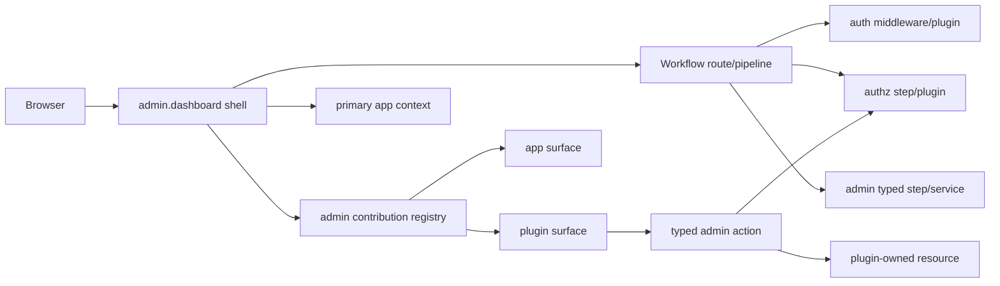

# Admin Dashboard Revival Design

## User Ask

Revitalize `workflow-plugin-admin` into a useful embedded admin mini-app. Other
Workflow modules/plugins must register admin UI surfaces without coupling to
admin auth, navigation, rendering, or other modules. Admin must use the auth
plugin for authentication and authz plugin for authorization, manage real app
auth/authz and other module-owned resources, advertise strict proto contracts,
use the Workflow ecosystem heavily, and prove app + admin behavior in
`workflow-scenarios`. No useful scope is deferred out of the roadmap; work may
be phased.

## Global Design Guidance

Source: `/Users/jon/workspace/AGENTS.md`; project-local `AGENTS.md`,
`CLAUDE.md`, and `docs/design-guidance.md` absent.

| guidance | design response |
|---|---|
| Dogfood Workflow/wfctl; fix platform rough edges | Admin is a Workflow plugin with typed module/step contracts and scenario proof. |
| Keep ownership boundaries explicit | Admin owns shell/navigation/session/resource dispatch; auth/authz own identity/policy primitives; contributing plugins own domain views/actions. |
| Prefer existing plugin conventions | Follow `workflow-plugin-auth` / `workflow-plugin-authz`: `internal/contracts/*.proto`, generated Go, `plugin.contracts.json`, `ContractRegistry()`. |
| Security and quality on platform surfaces | Authn/authz mandatory on management APIs; strict proto contracts; abuse cases in tests. |
| Frontend tools are usable first screens | Admin UI is the app shell itself, not a marketing page. |
| Prove multi-component behavior | Add workflow-scenarios case proving primary app + admin + contributed module surface. |

## Personas / Use Cases

| persona | needs |
|---|---|
| App operator | Login once, inspect app health, manage users/roles/policies, use plugin views. |
| Product developer | Compose admin into an app without writing dashboard plumbing. |
| Plugin author | Declare admin surfaces/actions through stable proto contracts. |
| Security admin | See only permitted views/actions; mutate identity/policy with audit-friendly requests. |
| Support engineer | Diagnose module state without direct DB/infra access. |

## Approach Options

| option | shape | pros | cons | decision |
|---|---|---|---|---|
| A. Keep old config-injection dashboard | Extend embedded YAML/static UI | Fastest | Current design unproven, too route-specific, no contribution contract | Reject |
| B. Admin as separate process/app | Dedicated port/app config, talks to target app APIs | Strong isolation | Harder app awareness, more deploy wiring, auth token sharing complexity | Partial: support dedicated route/port mode |
| C. Admin plugin as composable admin host | `admin.dashboard` module + typed contribution registry + shell UI + app-context bridge | Matches ask; reusable; contract-first | Requires new module/step surfaces and careful authz boundary | Choose |

## Architecture

Admin becomes a contract-first host module:

1. `admin.dashboard` module runs the admin shell, registry, static assets, and management API.
2. Auth is delegated to configured `auth.jwt` / auth plugin routes and middleware.
3. Authz is composed through Workflow pipelines/routes using existing
   `step.authz_*` or `step.permit_*` checks before admin actions execute.
   Admin never assumes an external plugin subprocess can directly call another
   plugin subprocess.
4. Plugins/apps register surfaces with strict proto messages: navigation, mount path, required permissions, rendering mode, resource actions, and target app context.
5. The shell lists only authorized surfaces and proxies/dispatches actions through typed resource/action contracts.
6. Admin may run on same app router prefix (`/admin`) or separate admin port/router while referencing a target app context.

## Contracts

New proto package: `workflow.plugins.admin.v1`.

| contract | purpose |
|---|---|
| `AdminDashboardConfig` | module config: route prefix, app name, auth module, authz module, mode, asset root. |
| `AdminContribution` | plugin/app contributed page or resource: id, title, category, path, permissions, render mode, metadata. |
| `RegisterContribution*` | step input/output for dynamic registration from workflows. |
| `ListContributions*` | list filtered/registered contributions. |
| `AuthorizeAdminAction*` | normalize subject/resource/action and consume upstream authz check results; default deny if no result exists. |
| `AdminResourceAction*` | typed CRUD/action request envelope for plugin-managed resources after route/pipeline authz. |

`plugin.contracts.json` advertises:

- module `admin.dashboard`
- steps `step.admin_register_contribution`, `step.admin_list_contributions`,
  `step.admin_authorize_action`, `step.admin_resource_action`
- service methods on `admin.dashboard`: `RegisterContribution`,
  `ListContributions`, `AuthorizeAction`, `DispatchResourceAction`

## Rendering Model

| mode | use |
|---|---|
| `internal` | built-in admin pages such as Overview, Auth, Authz, Contributions. |
| `asset` | static/micro-frontend assets served from plugin/admin asset mount. |
| `iframe` | isolated admin surface from another app route. |
| `json-schema` | generated forms/tables from strict resource/action metadata. |

Initial implementation ships internal + JSON-driven shell; asset/iframe are
contracted and accepted by registry but rendered as safe launch links until
full frontend build exists.

## App Context

Admin can be embedded in the primary app or run as a sidecar app:

| mode | routing | app awareness |
|---|---|---|
| embedded | same `http.server`/router under `/admin` | uses in-process modules and route context. |
| sidecar | admin server/port, e.g. `:8081` | configured `target_app` metadata + service endpoints. |

The `AdminDashboardConfig.target_app` field names the app being administered.
Contributions carry `app_context` so one admin can distinguish primary app
resources from admin-owned resources.

## Security Review

| topic | design |
|---|---|
| Authn | Admin routes require auth plugin session/token except explicit setup/status routes. |
| Authz | Workflow route/pipeline runs authz checks before admin action steps; admin also default-denies missing authz evidence. Hidden UI is not enforcement. |
| Least privilege | Contributions declare required permission per surface/action. Admin module denies missing permission by default. |
| Confused deputy | `AuthorizeAdminActionInput` includes subject, resource, action, tenant/app context; dispatch validates the contribution/action owner. |
| CSRF | Mutating admin endpoints require Bearer auth and JSON content type; scenario includes unauthenticated/unauthorized checks. |
| Secrets/PII | Config exposes module names, not secret values; user lists must be redacted summaries unless auth plugin returns full data under policy. |
| Trust boundary | Plugin-provided HTML can be isolated by iframe/asset mode; JSON-schema mode avoids arbitrary JS for resource management. |

## Infrastructure Impact

| area | impact |
|---|---|
| Cloud resources | None directly. |
| Network | Optional admin route/port; default embedded `/admin`. |
| Storage | Contributions are declarative/runtime registrations re-applied at startup; no admin-owned persistence needed for initial useful behavior. Domain state stays in owning plugins/apps. |
| Secrets | Reuses auth/authz module configuration; no new secret names assumed. |
| Deploy order | Auth/authz plugins must be available before protected admin management is enabled. |
| Cost | No new cloud cost. |

## Multi-Component Validation

| proof | scope |
|---|---|
| Unit tests | proto registry, contribution validation, authz deny defaults, config fragment. |
| Plugin contract test | `ContractRegistry()` descriptors match `plugin.contracts.json`. |
| Host-load smoke | admin plugin implements module/step/config/contract providers and builds. |
| Scenario | new `workflow-scenarios` case with primary app health route, auth/admin login, admin contribution list, authz deny, module-contributed surface. |

## Rollback

| change | rollback |
|---|---|
| Admin plugin module/step contracts | Revert plugin release; remove `admin.dashboard` from app config; old config-provider path remains until cutover. |
| Scenario | Remove scenario entry/files; no production impact. |
| Embedded UI | Revert asset commit; dashboard API remains testable. |
| Separate admin routing | Disable admin module or route prefix in YAML. |

## Phases

| phase | deliverable |
|---|---|
| 1 | Strict proto contracts, `admin.dashboard` module, contribution registry, typed steps, contract parity tests. |
| 2 | Embedded admin shell UI consuming contributions/auth/authz endpoints. |
| 3 | Auth/authz management actions: users, roles, policies, permission checks composed through existing auth/authz plugins; add missing auth/authz plugin primitives if scenario proof exposes a gap. |
| 4 | Plugin contribution integration pattern and docs/examples. |
| 5 | `workflow-scenarios` app + admin scenario with primary app and contributed surface. |
| 6 | Optional sidecar routing mode and app-context validation. |

## Assumptions

| id | assumption | challenge | fallback |
|---|---|---|---|
| A1 | Existing external SDK typed module/step/service descriptors are sufficient for admin plugin contracts | Admin-specific service discovery may need host changes | Start with module/step contracts + service descriptors in `ContractRegistry`; add host SDK changes only if tests prove gap. |
| A2 | Auth/authz plugin APIs can support management workflows when composed in Workflow routes/pipelines | User CRUD/policy CRUD may not expose enough typed primitives yet | Admin exposes management action contracts and uses available auth/authz steps first; missing primitives become explicit tasks in auth/authz repos before scenario is marked proven. |
| A3 | Scenario can prove a useful slice without live Kubernetes in local CI | Full scenario deploy may be environment-gated | Provide static scenario files and shell tests; run local plugin tests here, leave cluster execution documented if minikube unavailable. |
| A4 | JSON-schema/internal render mode is useful before arbitrary micro-frontends | Plugin authors may need rich custom UI immediately | Contract includes asset/iframe modes; phase 2 shell renders launch/isolation path safely. |
| A5 | User approval is pre-granted for autonomous design/plan/implementation | Brainstorming skill normally asks approval | Original ask explicitly says "Autonomously brainstorm, design, plan, and implement" and "I'm stepping away"; proceed with documented assumptions. |

## Self-Challenge

| doubt | response |
|---|---|
| Could this be just a static dashboard with links? | No: ask requires modules to register meaningful admin views and manage auth/authz of the real app. Static links do not solve contribution/action contracts. |
| Biggest fragile assumption? | A2: auth/authz management surfaces may need more plugin APIs. Plan must include concrete integration tests and backport gaps to auth/authz repos if discovered. |
| YAGNI risk? | Asset/iframe modes could overreach. Keep implementation minimal: validate/register them but full rich rendering follows after internal/json-schema shell. |
| What fails first? | Authz misconfiguration could expose admin surfaces. Route/pipeline authz plus admin default-deny evidence checks are required; test unauthenticated/unauthorized cases. |

## Adversarial Review Notes

| cycle | finding | design change |
|---|---|---|
| R1 | External plugin subprocess cannot safely assume direct calls into authz plugin modules. | Authz is now route/pipeline composition; admin consumes authz evidence and denies absent evidence. |
| R1 | Admin-owned persistent registry risks duplicating declarative Workflow config and plugin-owned domain state. | Registry is runtime/declarative; no admin persistence in initial architecture. |
| Repo precedent conflict? | Current admin config-injection design is intentionally not preserved because user says it is unmaintained/unproven; strict contracts follow mature auth/authz plugin precedent. |
